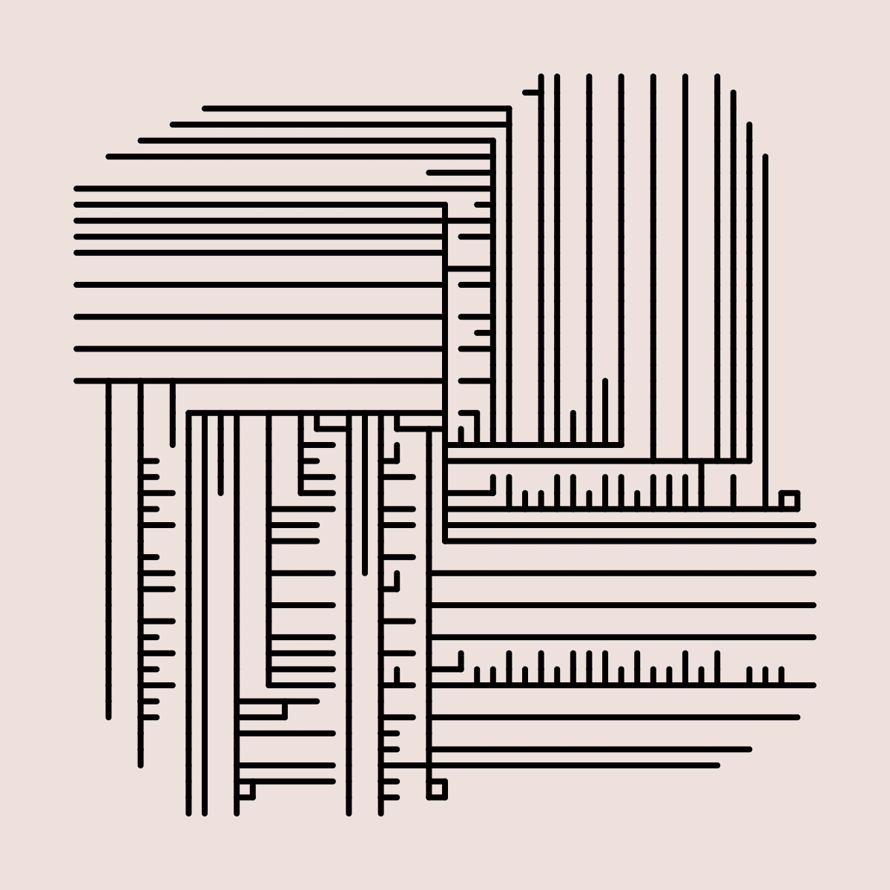

# Space colony


### Examples

The following were generated with these parameters:
```js
{
    lifespan: 48,
    maxDist: 32,
    minDist: 24,
    branchLength: 8,
    attractors: 25000,
    angle: 120,
    canvasSize: 600
}
```


-----

The following were generated with these parameters:
```js
{
    lifespan: 48,
    maxDist: 24,
    minDist: 12,
    branchLength: 4,
    attractors: 25000,
    angle: 90,
    canvasSize: 600
}
```



# Algo

A branch is a point that refers to its parent point. Together, those points form a segment (or a branch).
Branches are structured as points so they can be managed with a QuadTree for fast lookups.

As a tree grows, all segments of a larger branch can be affected by the food resources around it. (i.e. There's always a chance that a branch node can spawn a new branch).

When it comes time to optimize and clean up the drawing, there are segments that overlap and can be removed (especially for plotting). Doing this is sort of annoying with the way the branches are stored.

I want to:

  1. ~~Loop through all branches and see if there are any overlapping branches. (Flatten? Use quadtree?)~~
  2. ~~Remove overlapping branch segments.~~
  3. When removing an overlapping branch, removing a branch doesn't remove its parent so you are just removing the node, not the segment. But if you remove the segment, the parent might be the parent of another branch so you don't necessarily want to remove it... This is the trouble of the nodes and segments being mixed.


```zsh
/Applications/Inkscape.app/Contents/MacOS/inkscape -o output.png -w 2160 -h 2160 input.svg
```

```zsh
# BULK edits
/Applications/Inkscape.app/Contents/MacOS/inkscape --actions="export-width:2160px;export-height:2160px;export-type:png;export-do;" *.svg
```